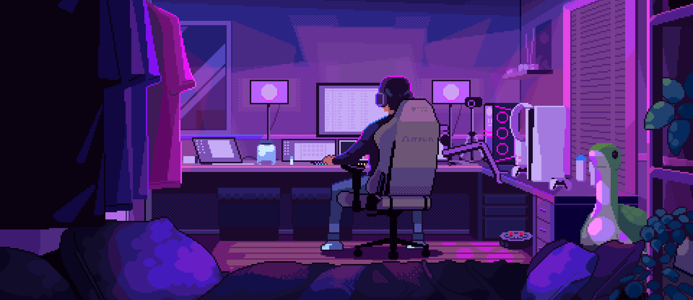

<a href="https://heatmap.shymike.dev?id=26998&labels=true&standalone=true" title="Click to view detailed data for each day!"  style="width:100%">
    <picture  style="width:100%">
        <source media="(prefers-color-scheme: dark)" srcset="https://heatmap.shymike.dev?id=26998&labels=true&theme=dark"  style="width:100%">
        
    </picture>
</a>
<br>


</br>

```markdown
😋 Just a simple coder
```

<p align="left"> 
 <br>
&nbsp;&nbsp;&nbsp;&nbsp;&nbsp;&nbsp;&nbsp;&nbsp;


 
<b>`Thankyou for following :)`</b>


</p>
<br>
<div id="toc">
  <ul align="left" style="list-style: none">
    <summary>
      <h1>
        👋 Hi, I'm Divyanshu Dhruv
      </h1>
    </summary>
  </ul>
</div>
<!--
```markdown
📬 Connect with me:
<p align="left"> <a href="https://github.com/divyanshudhruv" target="_blank"></a></p>
```
-->


<p align="left">
<h2 align="left"><b>😐 About me:</b></h2>

- ⚒️ I’m currently working on **NOTHING (theory)** ✨☄️

- 🔥 Creator of **[Theta0 • uhm, a Threads alternative](https://theta0.vercel.app)**

- 😏 Lead developer of **[Next Bench](https://next-bench-dev.vercel.app/)** 🪑

- 🌱 I’m currently learning about **`DSA`. `Web3` & `Cybersecurity`**

 - ⚡ Fun fact: **I love to play `Guitar`** 

-  😭 I miss **`2024`** 

- 📫 Find Me: **`Github`** , **`Discord`** , **`Codepen`** , **`Dev.to`**, **`Peerlist`**, **`Linkedin`**, **`Re-Folio`**

- ☕ My portfolio: [click click ✨](https://divyanshudhruv.is-a.dev) 
 
  <br>

  
 **<h2 align="left">💀 Skills & Stacks</h2>**

`SOOO MANYYY!!! (hello world, too)`

<table style="width: 100%; border: 0px solid white;">
  <tr>
    <td style="text-align: center; border: 0px; padding: 12px;">
      
    </td>
    <td style="text-align: center; border: 0px; padding: 12px;">
      
    </td>
    <td style="text-align: center; border: 0px; padding: 12px;">
      
    </td>
    <td style="text-align: center; border: 0px; padding: 12px;">
      
    </td>
    <td style="text-align: center; border: 0px; padding: 12px;">
      
    </td>
    <td style="text-align: center; border: 0px; padding: 12px;">
      </td>
    <td style="text-align: center; border: 0px; padding: 12px;">
      
    </td>
    <td style="text-align: center; border: 0px; padding: 12px;">
      
    </td> <td style="text-align: center; border: 0px; padding: 12px;">
      
    </td>
    <td style="text-align: center; border: 0px; padding: 12px;">
      
    </td>
     </tr>
 <tr>  
    <td style="text-align: center; border: 0px; padding: 12px;">
      
    </td>
    <td style="text-align: center; border: 0px; padding: 12px;">
      
    </td>
    <td style="text-align: center; border: 0px; padding: 12px;">
      
    </td>
    <td style="text-align: center; border: 0px; padding: 12px;">
      
    </td>
    <td style="text-align: center; border: 0px; padding: 12px;">
      
    </td>
    <td style="text-align: center; border: 0px; padding: 12px;">
      
    </td>
    <td style="text-align: center; border: 0px; padding: 12px;">
      
    </td>
    <td style="text-align: center; border: 0px; padding: 12px;">
      
    </td>  <td style="text-align: center; border: 0px; padding: 12px;">
      
    </td>
    <td style="text-align: center; border: 0px; padding: 12px;">
      
    </td>
   </tr>
 <tr>  
    <td style="text-align: center; border: 0px; padding: 12px;">
      
    </td>
    <td style="text-align: center; border: 0px; padding: 12px;">
      
    </td>
  <td style="text-align: center; border: 0px; padding: 12px;">
      
    </td>
    <td style="text-align: center; border: 0px; padding: 12px;">
      
    </td>
    <td style="text-align: center; border: 0px; padding: 12px;">
      
    </td>
    <td style="text-align: center; border: 0px; padding: 12px;">
      
    </td>
    <td style="text-align: center; border: 0px; padding: 12px;">
      
    </td>
    <td style="text-align: center; border: 0px; padding: 12px;">
      
    </td>
  <td style="text-align: center; border: 0px; padding: 12px;">
      
    </td>
    <td style="text-align: center; border: 0px; padding: 12px;">
      
    </td>
  </tr>
 <tr>  
  <td style="text-align: center; border: 0px; padding: 12px;">
      
    </td>
    <td style="text-align: center; border: 0px; padding: 12px;">
      
    </td>
    <td style="text-align: center; border: 0px; padding: 12px;">
      
    </td>
    <td style="text-align: center; border: 0px; padding: 12px;">
      
    </td>
    <td style="text-align: center; border: 0px; padding: 12px;">
      
    </td>
    <td style="text-align: center; border: 0px; padding: 12px;">
      
    </td>
  <td style="text-align: center; border: 0px; padding: 12px;">
      
    </td>
    <td style="text-align: center; border: 0px; padding: 12px;">
      
    </td>
  <td style="text-align: center; border: 0px; padding: 12px;">
      
    </td>
    <td style="text-align: center; border: 0px; padding: 12px;">
      
    </td>
  </tr>
 <tr>  
    <td style="text-align: center; border: 0px; padding: 12px;">
      
    </td>
    <td style="text-align: center; border: 0px; padding: 12px;">
      
    </td>
    <td style="text-align: center; border: 0px; padding: 12px;">
      
    </td>
    <td style="text-align: center; border: 0px; padding: 12px;">
      
    </td>
  <td style="text-align: center; border: 0px; padding: 12px;">
      
    </td>
    <td style="text-align: center; border: 0px; padding: 12px;">
      
    </td>
  <td style="text-align: center; border: 0px; padding: 12px;">
      
    </td>
    <td style="text-align: center; border: 0px; padding: 12px;">
      
    </td>
    <td style="text-align: center; border: 0px; padding: 12px;">
      
    </td>
    <td style="text-align: center; border: 0px; padding: 12px;">
      
    </td>
  </tr>
  <tr>  
    <td style="text-align: center; border: 0px; padding: 12px;">
      
    </td>
    <td style="text-align: center; border: 0px; padding: 12px;">
      
    </td>
   <td style="text-align: center; border: 0px; padding: 12px;">
      
    </td>
    <td style="text-align: center; border: 0px; padding: 12px;">
      
    </td>
  <td style="text-align: center; border: 0px; padding: 12px;">
      
    </td>
    <td style="text-align: center; border: 0px; padding: 12px;">
      
    </td>
    <td style="text-align: center; border: 0px; padding: 12px;">
      
    </td>
    <td style="text-align: center; border: 0px; padding: 12px;">
      
    </td>
    <td style="text-align: center; border: 0px; padding: 12px;">
      
    </td>
    <td style="text-align: center; border: 0px; padding: 12px;">
      
    </td>
  </tr> 
</table>

<br>

<details>
 <summary>
 <h2><b>🗃️ Current Projects</b></h2></summary>

- **📄**  [**Re-Folio (beta)**](https://re-folio.vercel.app/): Transform your `resume` into a stunning portfolio.

- **📨**  [**Klarity-AI**](https://klarity-ai.vercel.app/): Your `inbox`, chats, notes & chaos — turned into clarity.

- **☄️**  [**Sourceful Space**](https://coclip.vercel.app/): Empowering `developers` and designers to explore, share, and contribute to `open-source` projects with AI-crafted briefs.

- **📋**  [**CoClip**](https://coclip.vercel.app/): A universal `clipboard` that lets you copy text from one device and access it `anywhere` effortlessly.

- **🌊** [**DataDiver-AI**](https://datadiver-ai.vercel.app/):  The ultimate tool for web scraping, `transforming` unstructured websites into clean JSON.

- **🪑** [**Next-Bench - Sonamii**](https://next-bench-dev.vercel.app/?ref=github/divyanshudhruv): A user-friendly `web application` that helps students to find the best institutions near them.

- **🏮** [**ONGOING: RegexSimplify**](https://github.com/divyanshudhruv/#): A simple `package` to simplify regex using chainable APIs.

- **👋** [**STOPPED: SayHalo**](https://github.com/divyanshudhruv/sayhalo-slm): An `AI powered` SLM aggregator.

- **🎩** [**HelloLink**](https://github.com/divyanshudhruv/hellolink): Say `Hello` to your links, all in one place.

- **⛓️‍💥** [**Eeon**](https://github.com/divyanshudhruv/eeon): An `AI assistant` for emoticons.

 -  **🤖** [**Gitfolio**](https://github.com/divyanshudhruv/gitfolio): A `dynamic` github profile card generator

 - **✈️** [**Strix-ai**](https://github.com/divyanshudhruv/strix-ai): Easy `Delocalization`, fast and secure. 

- **💳** [**Pocket Vault**](https://github.com/divyanshudhruv/pocket-vault): A developer's vault for storing most used npm packages, deployments, snippets, repos, tools etc. 

 - **⚡** [**Gitlog**](https://github.com/divyanshudhruv/gitlog): A list of common `git commit messages` for version control 

 - **📁** [**Tidyfi**](https://github.com/divyanshudhruv/Tidyfi): A python `file` organizer

 - **📍** [**Minifolio**](https://github.com/divyanshudhruv/Minifolio): A `minimal` portfolio template for developers
 
 - **🔮** [**Portfolio**](https://github.com/divyanshudhruv/divyanshudhruv.github.io): My personal `portfolio`

- **🚩** [**Better-Markdown**](https://github.com/divyanshudhruv/Better-Markdown): `Tips` for markdown
</details>
 <details>
 <summary>
 <h2><b>🪐 My Gitroll</b></h2></summary>

 <a href="#" target="_blank"></a>
 &nbsp;&nbsp;&nbsp;&nbsp;&nbsp;
 <!--
 -->

</details>
 <br>

 **<h2 align="left">🤖 GitHub Stats</h2>**

<p align="left">
 <!--<br>--> 
 <br>
 <br>
</p>


<!--
<p align="left">
  
  
</p>
-->


