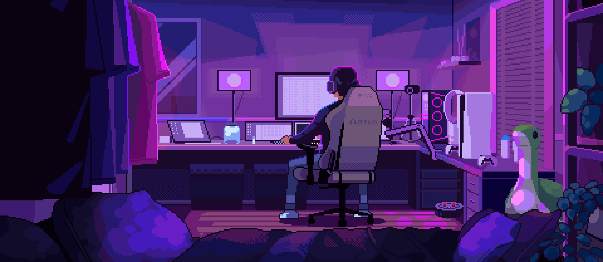

<a href="#" style="width:100%">
    <picture style="width:100%">
        <source media="(prefers-color-scheme: dark)" srcset="https://heatmap.shymike.dev?id=26998&labels=true&theme=dark" style="width:100%" />
        
    </picture>
</a>

 

 

  
 
 

  <ul align="left" style="list-style: none">
    

      <h1>
        👋 Hi, I'm Divyanshu Dhruv
      </h1>
    

  </ul>

## 😐 A little about me

- 🟧 Fellow @ **YC Startup School India 2k26**

- ⚒️ I’m currently working on **`WEAVE`** 🧵☄️

- 🌱 I’m currently learning about **`DSA`. `Web3` & `System Design`**

- ⚡ Fun fact: **I love to play `Guitar`**

- 😭 I miss **`2024`**

- 📫 Find Me: **`Github`** , **`Discord`** , **`Codepen`** , **`Dev.to`**, **`Peerlist`**, **`Linkedin`**, **`Re-Folio`**

- ☕ My portfolio: [click click ✨](https://divyanshudhruv.is-a.dev)

 

 

<table style="width: 100%; border: 0px;">
  <tr>
    <td width="50%" valign="top" style="border: 0px; padding: 6px;">
      
      
      
    </td>
    <td width="50%" valign="top" style="border: 0px; padding: 6px;">
      
      
      
    </td>
  </tr>
</table>

 

## 🔮 Skills and stacks

<table style="width: 100vw; border: 0px;">
  <colgroup>
    <col style="width: 30%;">
    <col style="width: 70%;">
  </colgroup>
  <tr>
    <td valign="top" style="border: 0px; padding: 8px; white-space: nowrap;"><code>markup & styling</code></td>
    <td style="border: 0px; padding: 8px;">
      
      
      
      
      
      
      
      
    </td>
  </tr>
  <tr>
    <td valign="top" style="border: 0px; padding: 8px; white-space: nowrap;"><code>programming languages</code></td>
    <td style="border: 0px; padding: 8px;">
      
      
      
      
      
      
    </td>
  </tr>
  <tr>
    <td valign="top" style="border: 0px; padding: 8px; white-space: nowrap;"><code>frontend frameworks</code></td>
    <td style="border: 0px; padding: 8px;">
      
      
      
      
      
    </td>
  </tr>
  <tr>
    <td valign="top" style="border: 0px; padding: 8px; white-space: nowrap;"><code>full-stack</code></td>
    <td style="border: 0px; padding: 8px;">
      
      
    </td>
  </tr>
  <tr>
    <td valign="top" style="border: 0px; padding: 8px; white-space: nowrap;"><code>2d / 3d graphics</code></td>
    <td style="border: 0px; padding: 8px;">
      
      
    </td>
  </tr>
  <tr>
    <td valign="top" style="border: 0px; padding: 8px; white-space: nowrap;"><code>testing</code></td>
    <td style="border: 0px; padding: 8px;">
      
      
    </td>
  </tr>
  <tr>
    <td valign="top" style="border: 0px; padding: 8px; white-space: nowrap;"><code>scripting & shell</code></td>
    <td style="border: 0px; padding: 8px;">
      
      
      
      
    </td>
  </tr>
  <tr>
    <td valign="top" style="border: 0px; padding: 8px; white-space: nowrap;"><code>backend runtimes</code></td>
    <td style="border: 0px; padding: 8px;">
      
      
      
    </td>
  </tr>
  <tr>
    <td valign="top" style="border: 0px; padding: 8px; white-space: nowrap;"><code>backend frameworks</code></td>
    <td style="border: 0px; padding: 8px;">
      
      
      
      
      
      
    </td>
  </tr>
  <tr>
    <td valign="top" style="border: 0px; padding: 8px; white-space: nowrap;"><code>api & messaging</code></td>
    <td style="border: 0px; padding: 8px;">
      
      
      
    </td>
  </tr>
  <tr>
    <td valign="top" style="border: 0px; padding: 8px; white-space: nowrap;"><code>databases</code></td>
    <td style="border: 0px; padding: 8px;">
      
      
      
      
    </td>
  </tr>
  <tr>
    <td valign="top" style="border: 0px; padding: 8px; white-space: nowrap;"><code>baas & orm</code></td>
    <td style="border: 0px; padding: 8px;">
      
      
      
    </td>
  </tr>
  <tr>
    <td valign="top" style="border: 0px; padding: 8px; white-space: nowrap;"><code>ai / ml</code></td>
    <td style="border: 0px; padding: 8px;">
      
      
      
      
    </td>
  </tr>
  <tr>
    <td valign="top" style="border: 0px; padding: 8px; white-space: nowrap;"><code>devops & cloud</code></td>
    <td style="border: 0px; padding: 8px;">
      
      
      
      
      
      
      
      
      
    </td>
  </tr>
  <tr>
    <td valign="top" style="border: 0px; padding: 8px; white-space: nowrap;"><code>deployment</code></td>
    <td style="border: 0px; padding: 8px;">
      
      
    </td>
  </tr>
  <tr>
    <td valign="top" style="border: 0px; padding: 8px; white-space: nowrap;"><code>package managers</code></td>
    <td style="border: 0px; padding: 8px;">
      
      
      
      
    </td>
  </tr>
  <tr>
    <td valign="top" style="border: 0px; padding: 8px; white-space: nowrap;"><code>build tools</code></td>
    <td style="border: 0px; padding: 8px;">
      
      
    </td>
  </tr>
  <tr>
    <td valign="top" style="border: 0px; padding: 8px; white-space: nowrap;"><code>ides</code></td>
    <td style="border: 0px; padding: 8px;">
      
      
      
      
      
      
      
    </td>
  </tr>
  <tr>
    <td valign="top" style="border: 0px; padding: 8px; white-space: nowrap;"><code>design</code></td>
    <td style="border: 0px; padding: 8px;">
      
    </td>
  </tr>
  <tr>
    <td valign="top" style="border: 0px; padding: 8px; white-space: nowrap;"><code>knowledge & docs</code></td>
    <td style="border: 0px; padding: 8px;">
      
      
      
      
    </td>
  </tr>
  <tr>
    <td valign="top" style="border: 0px; padding: 8px; white-space: nowrap;"><code>coding platforms</code></td>
    <td style="border: 0px; padding: 8px;">
      
      
    </td>
  </tr>
  <tr>
    <td valign="top" style="border: 0px; padding: 8px; white-space: nowrap;"><code>game development</code></td>
    <td style="border: 0px; padding: 8px;">
      
    </td>
  </tr>
  <tr>
    <td valign="top" style="border: 0px; padding: 8px; white-space: nowrap;"><code>hardware</code></td>
    <td style="border: 0px; padding: 8px;">
      
    </td>
  </tr>
  <tr>
    <td valign="top" style="border: 0px; padding: 8px; white-space: nowrap;"><code>community</code></td>
    <td style="border: 0px; padding: 8px;">
      
      
      
    </td>
  </tr>
</table>

> Yuh... I'm pretty comfortable with every languages and libraries on this list.

 

## 🗃️ Some of my current projects

> [!TIP]
> PROPOSED: Ideas still in concept phase

- **🗝️** [**Keyshard**](https://#): An ephemeral environment manager injecting `encrypted production secrets` directly into memory.

- **🔗** [**XxxxxxXx**](https://#): An autonomous professional networking simulator populated entirely by interacting `AI agents`.

- **🪈** [**Peerpipe**](https://#): A borderless, peer-to-peer terminal interface for secure, `decentralized` file transfers.

- **🗣️** [**Echoflow + Retain**](https://#): A standalone, high-performance terminal utility for localized `speech-to-text` processing.

 

> [!IMPORTANT]
> NEW FEATURED: Active projects I'm currently building

- **🌾** [**Silo**](https://github.com/divyanshudhruv/silo): Zero-infrastructure, `local-first` version manager with simpler commands, built for iterators and `AI agents`.

- **🧵** [**ONGOING: Weave**](https://weave.design/): A declarative orchestration engine for building autonomous, `YAML-defined` web data pipelines.
- **🌐** [**ONGOING: Cummand**](https://#): A minimalist `reverse-tunneling` CLI that exposes local servers to the web with real-time TUI logs.
- **🗿** [**Termux**](https://#): A lightweight `AI terminal` with a built-in editor and agents.

- **🗄️** [**AeroDB**](https://aerodb.system): A `RESP-compatible` network database featuring `scratch-built` vector similarity search and time-travel key versioning.

- **🧠** [**Retain**](https://#): An open-source, local-first `screen memory engine` providing a time-aware, personal LLM with absolute privacy.

- **📹** [**SHHHH: XxxXxxx**](https://xxxxxxx.build): A real-time, peer-to-peer terminal ASCII `xxxxx xxxxxxxxxxxx` platform built with XxxXXX and Textual.

- **📨** [**BANNED: KlarityAI**](https://klarity-ai.vercel.app/): Your `inbox`, chats, notes & chaos - turned into clarity.

   

> [!WARNING]
> OLD: Earlier projects (still maintained)

- **📄** [**Re-Folio (beta)**](https://re-folio.vercel.app/): Transform your `resume` into a stunning portfolio.

- **☄️** [**Sourceful Space**](https://sourceful.space/): Empowering `developers` and designers to explore, share, and contribute to `open-source` projects.

- **👋** [**SayHalo**](https://sayhalo-slm.vercel.app): An `AI powered` SLM aggregator.

- **🎩** [**HelloLink**](https://github.com/divyanshudhruv/hellolink): Say `Hello` to your links, all in one place.

- **🪑** [**Next-Bench - Sonamii**](https://nextbench.vercel.app): A user-friendly `web application` that helps students to find the best institutions near them.

- **🏮** [**ONGOING: RegexSimplify**](https://github.com/divyanshudhruv/#): A simple `package` to simplify regex using chainable APIs.

 

> [!CAUTION]
> VERY OLD: Archived experiments and early work

- **📋** [**CoClip**](https://coclip.sh/): A universal `clipboard` that lets you copy text from one device and access it `anywhere` effortlessly.
- **🌊** [**DataDiver-AI**](https://datadiver-ai.vercel.app/): The ultimate tool for web scraping, `transforming` unstructured websites into clean JSON.
- **⛓️‍💥** [**Eeon**](https://github.com/divyanshudhruv/eeon): An `AI assistant` for emoticons.
- **🤖** [**Gitfolio**](https://github.com/divyanshudhruv/gitfolio): A `dynamic` github profile card generator
- **✈️** [**Strix-ai**](https://github.com/divyanshudhruv/strix-ai): Easy `Delocalization`, fast and secure.
- **💳** [**Pocket Vault**](https://github.com/divyanshudhruv/pocket-vault): A developer's vault for storing most used npm packages, deployments, snippets, repos, tools etc.
- **⚡** [**Gitlog**](https://github.com/divyanshudhruv/gitlog): A list of common `git commit messages` for version control
- **📁** [**Tidyfi**](https://github.com/divyanshudhruv/Tidyfi): A python `file` organizer
- **📍** [**Minifolio**](https://github.com/divyanshudhruv/Minifolio): A `minimal` portfolio template for developers
- **🚩** [**Better-Markdown**](https://github.com/divyanshudhruv/Better-Markdown): `Tips` for markdown

  

## 😵 Some random stats

<table border="0" cellspacing="12" cellpadding="0">
  <tr>
    <td width="50%" valign="top">
      
      
      
    </td>
    <td width="50%" valign="top">
      
      
      
    </td>
  </tr>
  <tr>
    <td width="50%" valign="top">
      
    </td>
    <td width="50%" valign="top">
      
    </td>
  </tr>
  <tr>
    <td colspan="2" valign="top" style="padding-top: 0px; ">
      
      
    </td>
  </tr>
    <tr>
    <td colspan="2" valign="top" style="padding-top: 0px; ">
      <picture>
        <source media="(prefers-color-scheme: dark)" srcset="https://raw.githubusercontent.com/divyanshudhruv/divyanshudhruv/output/graphs/bomberman-contribution-graph-dark.svg">
        <source media="(prefers-color-scheme: light)" srcset="https://raw.githubusercontent.com/divyanshudhruv/divyanshudhruv/output/graphs/bomberman-contribution-graph.svg">
        
      </picture>
    </td>
  </tr>
    <tr>
    <td colspan="2" valign="top" style="padding-top: 0px; ">
      <picture>
        <source media="(prefers-color-scheme: dark)" srcset="https://raw.githubusercontent.com/divyanshudhruv/divyanshudhruv/output/graphs/github-snake-dark.svg">
        <source media="(prefers-color-scheme: light)" srcset="https://raw.githubusercontent.com/divyanshudhruv/divyanshudhruv/output/graphs/github-snake.svg">
        
      </picture>
    </td>
  </tr>
</table>

<!--

  

    
    
    
  

  

    
    
    
  

  

    
  

  

    
  

  
  

-->
