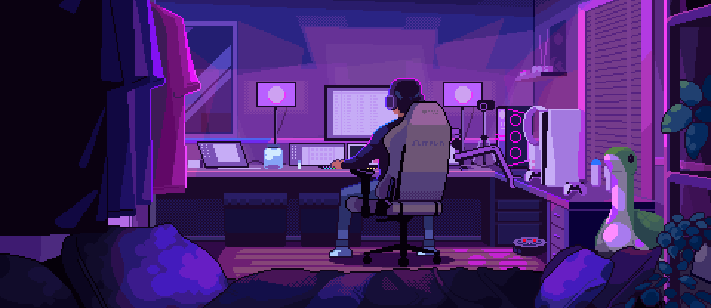

<!---->

---

 

<h1>
ğ—›ğ—¶, 👋🻠ğ—œ'ğ—º ğ——ğ—¶ğ˜ƒğ˜†ğ—®ğ—»ğ˜€ğ—µğ˜‚ ğ——ğ—µğ—¿ğ˜‚𘃠
</h1>

<code>&nbsp;Just a coder ✌🏻</code>
    
 

  &nbsp;&nbsp;&nbsp; 
  &nbsp;&nbsp;&nbsp;  &nbsp;&nbsp;&nbsp; &nbsp;&nbsp;&nbsp;

 

<h1><b>🫥 About Me</b></h3>
 

> ⚒️ I’m currently working on **SAAS application**

> 🌱 I’m currently learning about **Database**

> ⚡ Fun fact: **I love to play Guitar** 

  
> 📫 Find Me: **Github** , **Discord** , **Codepen** , **Dribbble**

   
  

  <h1><b>📁 My Projects</b></h1>

 

> **📍** [**Minifolio**](https://github.com/divyanshudhruv/Minifolio): A minimal portfolio template for developers

> **🤖** [**Portfolio**](https://github.com/divyanshudhruv/divyanshudhruv.github.io): My personal portfolio
 
 > **🚩** [**Better-Markdown**](https://github.com/divyanshudhruv/Better-Markdown): Tips for markdown

   
  

<h1><b>🔦 Tech and Tools</b></h1>

 

> 🕹️ Frontend Development
   

  
  
  
  
    
  
  
  
  </img>
  
  </img>
  
</img>

   

###

> 🧪 Programming Languages

 
  
  
  </img>
    
</img>
  
  
  
  </img>
  
  </img>
  

   

###

> 📌 Terminals
 

  
    
    
      
  </img>
  </img>

 

###

> ☢️ Framework
 

   
  </img>
    
 
  
      
      </img>
  
</img>
</img>
</img>
</img>
</img>

 

###

> 🔒 Database
   

  
  
    
  
    
  

  
</img>
</img>
             

 

###

> 🖌️ Designing
   

  
    
  </img>

  

 

###

> 🚀 Others
   

 </img>

</img>

    
  
 

 
<h1>⌚ Github Stats</h3>

 
  
> 

 

> 

  
  
>  
